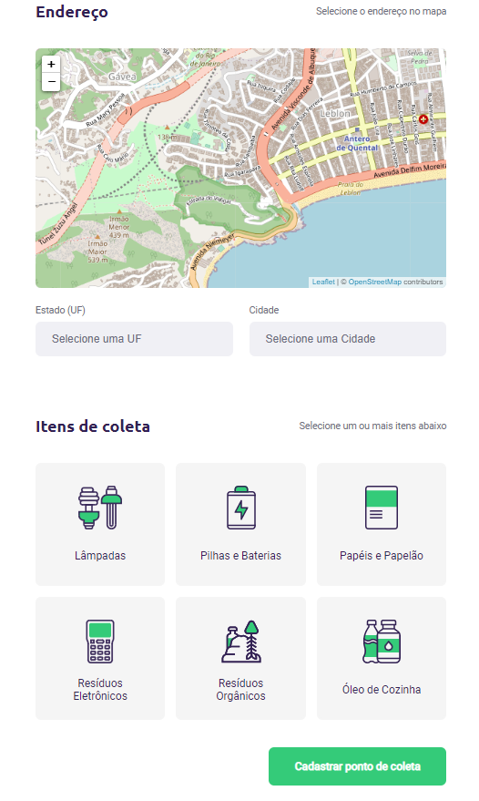

<!-- Gera uma imagem no centro do readme, dê preferência para usar SVG  -->
<h1 align="center">
    
</h1>

<h4 align="center"> 
	:recycle: Ecoleta :recycle:
</h4>

  <!-- Mostra um botão que tem uma contagem de quantos tipos diferentes de linguagens são utilizadas nesse repositório -->
  
  <!-- Tamanho do repositório -->
  
	<!-- Link para o linkedin -->
  
  <!-- Ultimo commit -->
  
  <!-- Licensa -->
  
  <!-- Quantas estrelas o repositório recebeu -->
   

  <a href="#-project">Projeto</a>&nbsp;&nbsp;&nbsp;|&nbsp;&nbsp;&nbsp;
  <a href="#rocket-Technologies">Techs</a>&nbsp;&nbsp;&nbsp;|&nbsp;&nbsp;&nbsp;
  <a href="#-layout">Layout</a>&nbsp;&nbsp;&nbsp;|&nbsp;&nbsp;&nbsp;

## 💻 Projeto

O Ecoleta é uma aplicativo baseado na semana internacional do meio embiente. Com o objetivo de conectar pessoas à estabelecimentos que fazem coleta seletiva de alguns tipos de lixo que podem ser reutilizados, reciclados ou que precisam de um descarte mais cuidadoso.
O projeto foi desenvolvido durante o evento Next Level Week da Rocketseat versão booster.

<h1 align="center">
    
</h1>

No desenvolvimento deste aplicativo foi possível praticar e relembrar diversos conceitos do ReactJS, NodeJS e React Native, com integração de uma api do IBGE para endereços e utilização de mapas com geolocalização.

<h1 align="center">
    
</h1>

## :rocket: Techs

Este projeto foi desenvolvido utilizando as seguintes tecnologias:

- [Node.js][nodejs]
- [TypeScript][typescript]
- [React][reactjs]
- [React Native][rn]
- [Expo][expo]

## 🔖 Layout

Para acessar o layout utilize o [Figma](<https://www.figma.com/file/9TlOcj6l7D05fZhU12xWT3/Ecoleta-(Booster)>).

Made with ♥ by Wallace Gomes :wave: [Get in touch!](https://www.linkedin.com/in/wallace-cardoso-gomes/)

[nodejs]: https://nodejs.org/
[typescript]: https://www.typescriptlang.org/
[expo]: https://expo.io/
[reactjs]: https://reactjs.org
[rn]: https://facebook.github.io/react-native/
